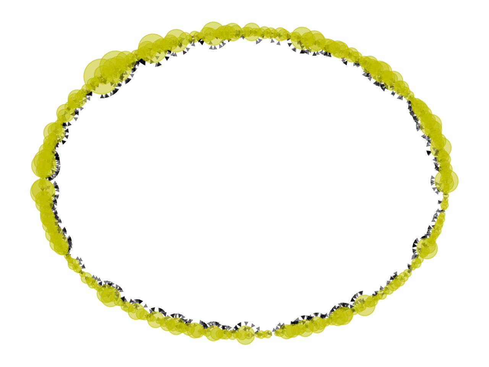
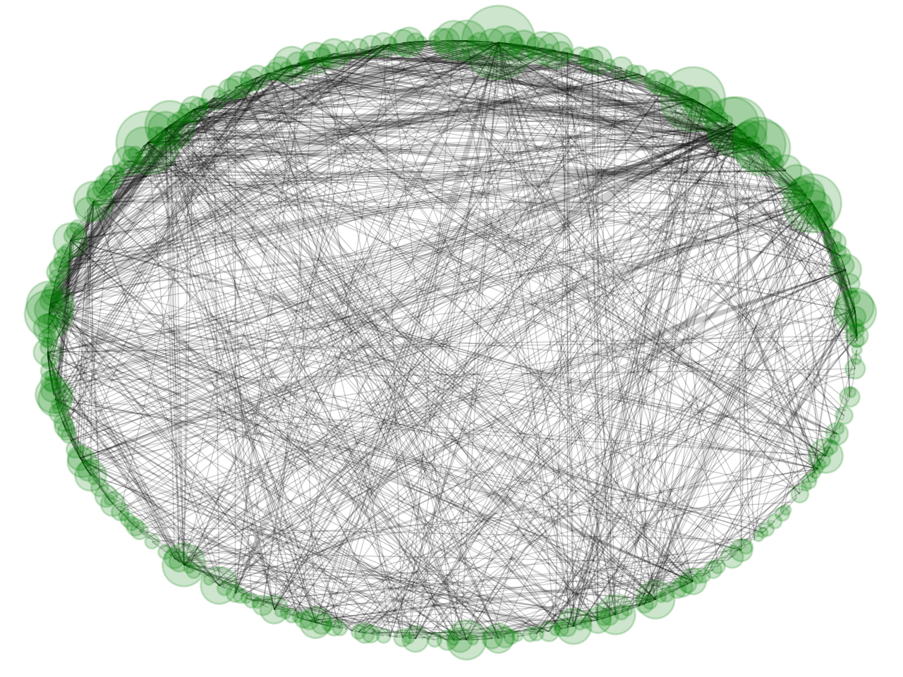
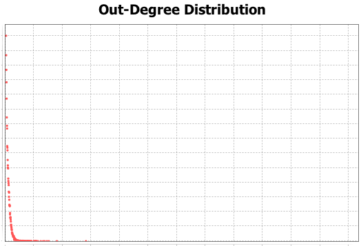
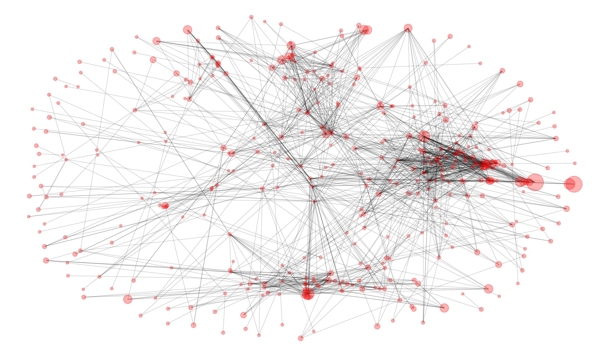
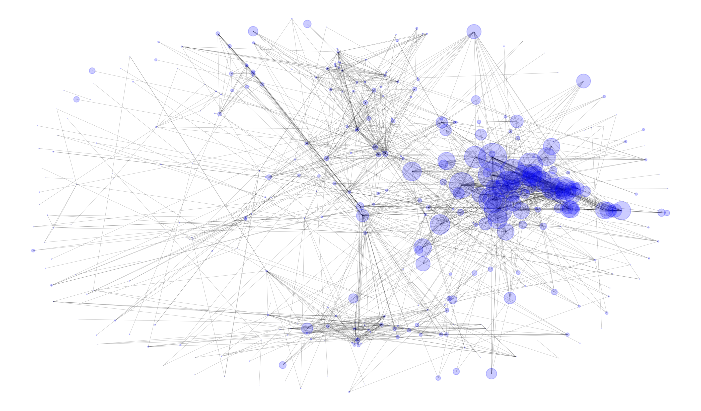
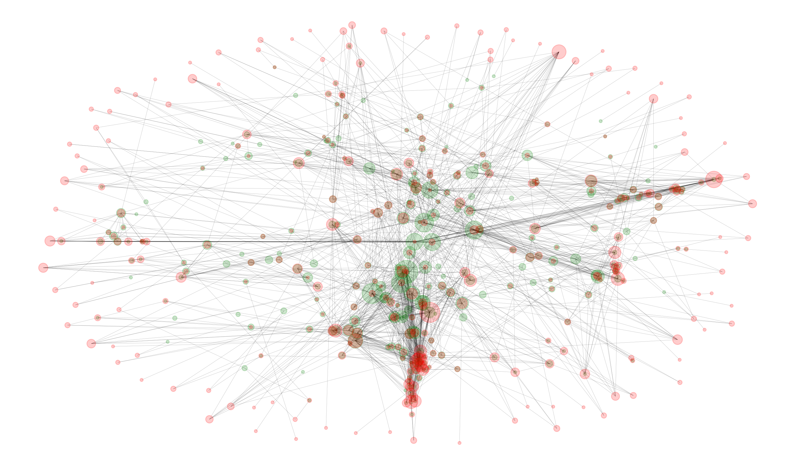
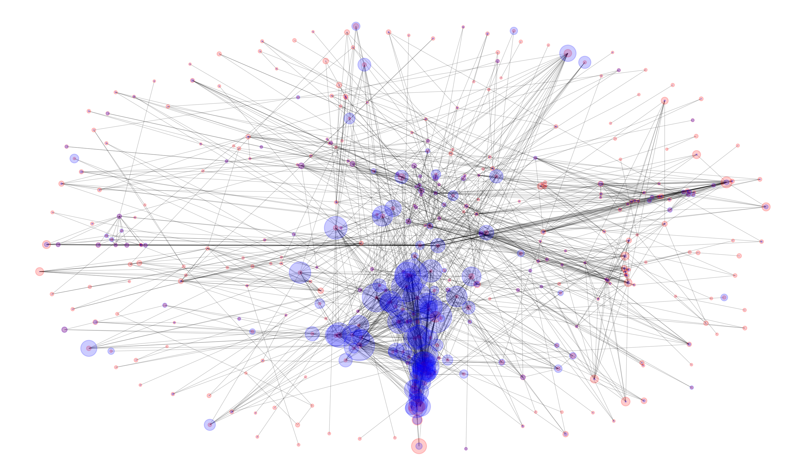
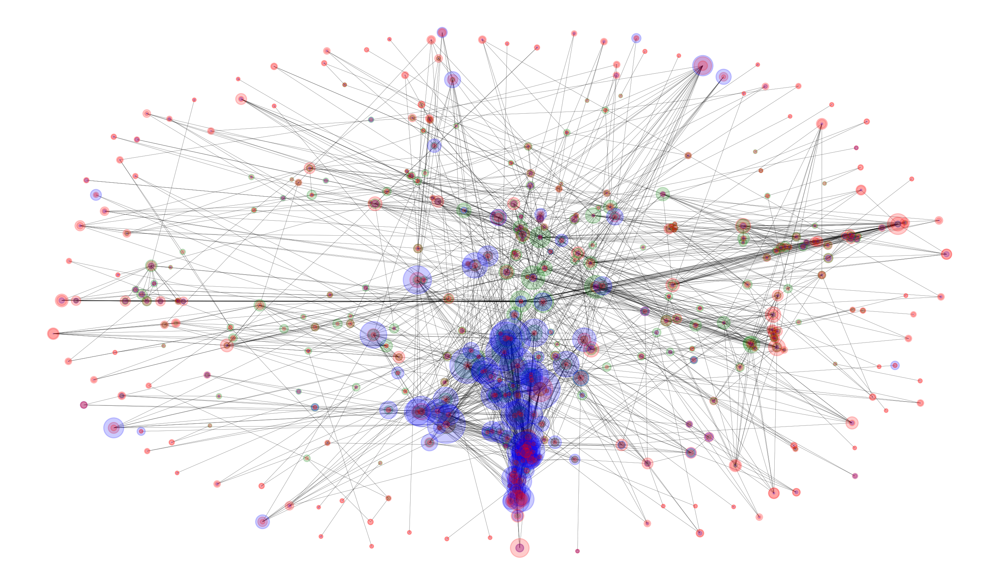

# Network Science
>Southern University of Science and Technology, Department of Computer Science and Engineering
>>11510365 XueYiheng

[toc]
## 1. 引言
1.	在已有的示例代码中已经完成了文本的引入以及预处理，可以得到图的格式的数据，名称为`G`。
2. 我们的重点不在python的正则表达处理文本，所以直接对`G`进行使用，通过`G.nodes()`与`G_edges()`即可返回此图的大致信息。
3. 通过`len()`获取到此图包含397个`node`和1597个`edges`，初步估算本计算机硬件可以支持397*397的矩阵运。
4. 根据已有的点和边的信息生成对应矩阵。
5. 在生成矩阵的基础上，结合网络科学的图论知识，得到`In degree centrality`和`Out degree centrality`
6. 对PageRank\_score和Eigenvector\_centrality不同方法对点的排序进行比较分析

## 2. 算法实现
通过示例代码可以直接输入`G`，并且很容易获取此图的`nodes`和`edges`信息，分析代码可知，返回`citenet.py`中的`cite_list`作为`nodes`的输入，删除此数组中的重复项即可。

```python
nodes = list(set(cite_list))
```

同样，我们也可以通过已有的输入，将图`G`中的`G.nodes()`与`G.edges()`格式化到处到`nodes`和`edges`中。

```python
nodes = list(G.nodes())
edges = list(G.edges())
```

初始化一个矩阵，尺寸根据`nodes`的长度决定，在之后的计算中都会用到这个矩阵`S`

```python
import numpy as np
N = len(nodes)
S = np.zeros.([N, N])
```

对于`edges`中的信息，我们将他体现在矩阵`S`中。

```python
for edge in edges:
	S[edge[1], edge[0]] = 1
```

大功告成，我们在之后的计算中，会对此处的`S`进行操作计算。

### 2.1 节点度(Degree Centrality)
在已有的矩阵`S`中进行分析，各个顶点的`入度 =  各列的和`， 各个顶点的`出度 = 各行的和`。

#### 2.1.1 In Degree Centrality
通过邻接矩阵`S`进行计算，求出各列的和。

```python
in_degree_1 = S.sum(axis = 0)
```

对图`G`中的邻接表字典直接进行操作，计算入度需要统计在几何右侧出现的次数。

```python
in_degree_2 = dict((u, 0) for u in G)
for u in G:
	for v in G[u]:
		in_degree_2[v] += 1
```

#### 2.1.2 Out Degree Centrality
求出邻接矩阵各行的和。

```python
out_degree_1 = S.sum(axis = 1)
```

通过邻接表计算出度需要计算每一个顶点对应的集合长度。

```python
out_degree_2 = dict((u, 0) for u in G)
for u in G:
	out_degree_2[u] = len(G[u])
```

### 2.2 特征向量(Eigenvector Centrality)
$$\mathbf{Ax} = \lambda \mathbf{x}$$ where $A$ is the adjacency matrix of the graph`G`with eigenvalue $\lambda$. By virtue of the Perron–Frobenius theorem, there is a unique and positive solution if $\lambda$ is the largest eigenvalue associated with the eigenvector of the adjacency matrix $A$ [^1]


[^1]: 引用自维基百科 https://en.wikipedia.org/wiki/Eigenvector_centrality
[^2]: https://www.sci.unich.it/~francesc/teaching/network/eigenvector.html
简言之，对一个点而言，如果引用他的点很多那么他的值会很大，或者他连接到了其他值很大的点，那么他的值也会变得更加大（假如我同时认识很多影响力很大的人，那么我的影响力就会很大）。[^2]


```r
#Input: G, precision
#Output: List with centrality vector and eigenvalue
#这部分未能独立实现，在后面使用nx的包进行分析
A = get.adjacency(G);
n = vcount(G);
x0 = rep(0, n);
x1 = rep(1/n, n);
eps = 1/10^t;
iteration = 0;
while(sum(abs(x0-x1)) > eps){
	x0 = x1;
	x1 = as.vector(x1%%A);
	x1 = x1 / m;
	iteration = iteration + 1;
}
return(list(vector = x1, value = m, iteration = iteration))
```


### 2.3 PageRank Score
对一个网页对其他网页的PageRank贡献值进行归一化处理。

```python
for j in range(N):
	sum_col = sum(S[:, j])
	for i in range(N):
		S[i, j] /= sum_col
```
[^3]: 部分思路参考自CSDN博客 https://www.csdn.net 以及博客园 https://www.cnblogs.com

在PageRank中，默认的$\alpha=0.85$,接下来计算矩阵`p_m`，将生成的PageRank值记录在`pr_n`与`pr_n1`中用于接下来的迭代。[^3]


```python
alpha = 0.85
p_m = alpha * S +(1-alpha) / N * np.ones([N,N])

pr_n = np.ones(N) / N
pr_n1 = np.zeros(N)

error = 100000
iteration_times = 0

while error > 0.00000001:	#参考CSDN网页，还不是很清楚这里的误差为什么取特定的值
	pr_n1 = np.dot(p_m, pr_n)
	error = pr_n1 - pr_n
	error = max(map(abs, error))
	pr_n = pr_n1
	iteration_times+=1
print('Final result: ', pr_n)
``` 

## 3. 对结果进行排序
在python中，通过**sorted函数**可以对`list`或者`dict.values()`进行排序。

```python
sorted(zip(pr_n.keys(), pr_n.values()))[-10:]
```
简单处理后可以得到的排序结果如下：
### 3.1 PageRank_score
>
	 'Logan JR 2004',4.180165852
	 'Dobbin F 2007',4.212408097
	 'Ross SL 2005',4.735509775
	 'Soule SA 2006',5.42769884
	 'Walker ET 2008',6.412681347
	 'Earl J 2004',6.482564678
	 'Meyer DS 2004',7.130642118
	 'Kalev A 2006',7.615216731
	 'Weber K 2009',14.10942448
	 'King BG 2007',15.73343312


如上方法可以得到PageRank值最大的10个样本信息。

对入度、出度、特征向量等信息是用同样的方法得到的结果如下：

### 3.2 In_degree
>
	 'Sampson RJ 2002',16
	 'Benford RD 2000',17
	 'Mcadam D 2001',18
	 'Charles CZ 2003',19
	 'King BG 2007',19
	 'Cress DM 2000',21
	 'Sampson RJ 2005',21
	 'Kalev A 2006',29
	 'Earl J 2004',35
	 'Meyer DS 2004',43
	 


### 3.3 Out_degree
>
	 'Gamson W 1990',24
	 'Mccarthy JD 1996',25
	 'Granovetms 1973',29
	 'Meyer JW 1977',30
	 'Dimaggio PJ 1983',31
	 'Denton Nancy A 1993',35
	 'Wilson W J 1987',37
	 'Tilly C 1978',41
	 'Mcadam Douglas 1982',43
	 'Mccarthy JD 1977',56
	 

### 3.4 Eigenvalue_centrality
>
	 'Mcadam D 2001',0.15747262
	 'Tarrow S 1998',0.179385477
	 'Gamson W 1990',0.202643641
	 'Mcadam Douglas 1982',0.213086152
	 'Mccarthy JD 1996',0.222540782
	 'Tilly C 1978',0.232567039
	 'Earl J 2004',0.238833521
	 'Cress DM 2000',0.244360972
	 'Mccarthy JD 1977',0.271148765
	 'Meyer DS 2004',0.271448977
	 
	 
## 4. 分析

### 4.1 In\_degree and Out\_degree
在degree的图像分析中，比较关注各个点的连接情况，除了node显示出来的大小之外，更关注他们所连的边的情况，所以通过`width=0`将边都删除掉，所以使用如下布局方式及代码

```python
layout = nx.circular_layout(G)

nx.draw(G, node_size=[x*10000 for x in in_degree_1.values()], node_color='y', width=0, alpha=0.5, pos=layout)
```
><div align=center>Figure-in_degree</div>
>再绘图中，入度值越大的点的尺寸越大，在途中很明显可以看到越大的源泉周围的黑色箭头（黑色箭头表示边的指向，在画图过程中避免干扰，省去了直线变边，仅保留了指向箭头）越密集、越多，实验结果的趋势符合理论结果。


对出度进行研究的时候，箭头是入度比较关注的，所以在这个环节通过`arrows=False`将有向图中的箭头去掉

```python
nx.draw(G, node_size=[x*10000 for x in out_degree_1.values()], node_color='g', width=0.5, arrows=False, alpha=0.2, pos=layout)
```	 
><div align=center>Figure-out_degree</div>
>再绘图中省略了指向性箭头，会造成入度和出度难以区分的误差，但还是很明显可以看出尺寸越大的点的周围黑色线条越密集，即与他相连的直线越多，可以认为是他的出度越高，图中的分布情况可以体现出理论结果的趋势。


我们对outdegree进行分布分析得到结果如下图所示，其余数据集的方法类似不再重复分析。
><div align=center>Figure-outdegree_distribution</div>
>很明显，经过分析后验证得到，在这个数据集中的出度也符合`Power_Law`分布。[^4]

[^4]: 使用了gephi进行绘图分析 https://gephi.org

### 4.2 PageRank Score
接下来我们主要关注点的大小关系以及与他周边点的关系，所以不能使用上述的`circulat_layout`，使用新的布局并结合我的算法得到的pagerank结果绘制图像。

```python
layout = nx.spring_layout(G)

nx.draw(G, node_size=[x*10000 for x in pr.values()], node_color='r', width=0.2, arrows=False, alpha=0.2, pos=layout)
```
><div align=center>Figure-pagerank_score</div>
>在结合pagerank算法得到各个点的值之后，在图中通过值的大小的不同导致显示点的大小也不同，可以明显地看到比较大的几个点之间的相连关系，处于边缘的点普遍都很小，但是如果他连着较多的点，自己的尺寸也会比周围大一些，符合理论情况。


### 4.3 Eigenvector Centrality

```python
nx.draw(G, node_size=[x*6000 for x in entrality.values()], node_color='b', width=0.2, arrows=False, alpha=0.2, pos=layout)
```

><div align=center>Figure-eigenvector_centrality</div>
>在这个途中蓝色部分重叠过多，对分析有一些影响。可以明显看到尺寸较大的点之间是存在相连关系的，即使处于远端边缘的点，如果连到了一个很大的靠近中间的点，那么大的尺寸也会比边缘其余各点要大，否则处于边缘的点的尺寸小到几乎没有，该方法的核心是引用到更大的点，那么自己的尺寸也会变得很大。


### 4.4 综合分析
除了单独对四个值进行分析之外，还需要对他们结合起来进行研究，比较他们的大小之间是否存在相关性与必然的联系性。在本文的**`3. 对结果进行排序`**中，比较分析四组值的前十位，不难发现他们之中存在重合的点，但存在差异的点也很多。

* 入度最大的`Meyer DS 2004`，同样也是`eigencalue_centrality`最大的点，在社会网络中等同于‘风流人物’，说明这篇文章比较受欢迎，有影响力。
* 出度比较大的几个点的其他值普遍不高，这些文章偏向于总结与引用，很少被别人用来做参考。
* 入度与出度间的差异比较明显，很少有点的入度与出度都很大，但有点的入度与出度都很小，通过下图比较明显看出此结论。

>因为黄色和绿色比较接近，所以这里的`in_degree`变为红色，`out_degree`照样使用绿色。
><div align=center>Figure-in\_degree and out_degree</div>

* 同样也对`pagerank_score`和`eigenvector_centrality`进行对比分析，两者没有很明显的必然关系，在**sort**的前十组数据中也没有明显的特征，但是在值很小的点处，`pagerank_score`值稍微大一些的点的`eigenvector_centrality`的值也普遍会比周围大一些，在下图的边缘地区这种情况很明显，但是两者并没有线性必然关系，只可以定性，目前很难定量分析。

><div align=center>Figure-pagerank_score and eigenvector_centrality</div>

* 对上图再次进行分析，红色代表的`pagerank`值越大，可能是由于自身比较强，自身的值很大，但是并不代表他的蓝色的`eigenvector_centrality`就会很大，蓝色是需要通过引用其他值很高的点来提高自己，所以蓝色比较大的点比较集中，大家相互连接，而红色的的点间存在制约性，因为总值不变，一个变大就会导致其他的变小。
* 最后，将四个值体现在同一个图里，得到的效果与理论相符合。

><div align=center></div>
><div align=center></div>
>
><div align = right><font color=red size=2>PageRank_score</font>
><font color=blue size=2>Eigenvector_centrality</font>
><font color=green size=2>Out_degree</font>
><font color=yellow size=2>In_degree</font></div>


## 5. 课程总结
通过三周的学习，从基本的图论出发，逐渐有力理论基础后涉及到了一些经典的模型、方法以及算法，对图有了比较深层次的理解。在图的分析中，掌握了完整的流程，了解到了如何分析一个图中各部分的重要性并可以通过不同的参数来量化他，比如本次project中的四个值。还可以借助python中的包以及gephi等软件来实现可视化，将真实的数据集的特征呈现出来，有理论的支撑与实践的检测。这次的project的大多数问题出现在python的使用以及硬件的支持上，通过理论课的学习对各个方法的数学原理有了初步的理解之后，在实现的过程中变得很容易，python中对图的处理之前没有接触过，将大量的数值在字典、数组等多种格式下的转化不仅会犹豫粗心而造成大错，也会给硬件设施带来很大的压力，以后还需要对算法进行优化，降低其复杂度以及内存占用程度。在图的领域产生了一些兴趣，在今后的学习与处理问题的过程中，应该会变得更加灵活，思维更加开拓。


